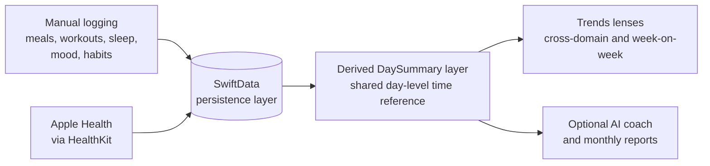

<h1 align="center">Hi, I'm Mohamed Farid </h1>

  
  
  

  

## About Me

I studied Computer Science at The University of Manchester, first a BSc and then an MSc in Advanced Computer Science, and I graduate in December 2026.

Most recently I built Pell, an iOS app that puts nutrition, training, sleep, mood, and habits in one place. Before that I interned at The Times, and I spent a year on the Formula Student team working on autonomous navigation.

I'm open to graduate Software Engineer and Machine Learning Engineer roles, so if you're hiring, I'd love to chat.

## What I'm Up To

Right now I'm polishing the third version of [mohfarid.com](https://mohfarid.com), which is built around an interactive iMessage style app, and wrapping up my MSc.

## Experience

| Role | Organisation | Dates |
|---|---|---|
| Founder and Software Engineer | Pell Health | Jan 2026 to Sep 2026 |
| Software Engineer Intern | The Times, News UK Technology | Jul 2024 to Aug 2024 |
| Software Engineer | UniCS Manchester | Aug 2024 to Dec 2024 |
| Artificial Intelligence Engineer | Manchester Stinger Motorsports (Formula Student) | Sep 2023 to Jul 2024 |

## Spotlight: Pell

Pell is a iOS app that combines nutrition, training, sleep, mood, and habits into one place so users can see how those areas affect each other. It was shipped to 25 beta users, and a 20 participant evaluation study scored it SUS 69.5 (above the 68 benchmark), with 70% preferring it over separate apps.

## Featured Projects

| Project | What it is | Stack |
|---|---|---|
| **[Food-Domain RAG System](https://github.com/08mfp)** | Five stage retrieval augmented generation pipeline benchmarking chunking, embedding, and retrieval strategies. Reached 98.9% Recall@5 and 92.1% MRR. | Python, PyTorch, Hugging Face, BM25 |
| **[Fixture Scheduling Web App](https://www.youtube.com/watch?v=ucq8gGAr99k)** | BSc dissertation (71%). Constraint-based fixture scheduler with an Express REST API that sustained 500 requests/sec at 200 ms. | React, Node.js, TypeScript, MongoDB |
| **[Deep Learning for Robotic Vision](https://github.com/08mfp)** | Controlled CIFAR-100 experiments comparing deep and lightweight CNNs, with pruning and quantisation studies. Graded 90%. | Python, PyTorch, Keras |
| **[Computer Vision Pipeline](https://github.com/08mfp)** | Feature matching at 92% accuracy and StereoBM 3D reconstruction at 25 FPS. | Python, OpenCV, NumPy |
| **[Client-Server Messaging App](https://github.com/08mfp/Python-Messaging-Program-V2)** | Multi-user messaging with private and group chats, server side auditing, and deadlock prevention. | Python, Tkinter |
| **[Portfolio Website](https://mohfarid.com)** | Third version of my portfolio, centred on an interactive iMessage style app. | React, TypeScript, Vite, Vercel |

<b>More projects</b>

 

| Project | What it is | Stack |
|---|---|---|
| **Real Estate Listings Website** | Listings site with a Mapbox map, real time availability, and a secure auth back end. Averaged 500 weekly visitors and helped reach full occupancy within a month of launch. | React, Node.js, TypeScript, Tailwind |
| **Events and Venue Management App** | Led a team of 4 building an Eventbrite style platform with interactive maps, scheduling, and discussion boards. | Java, Spring MVC |
| **Company Management Database** | Database normalised to 3NF with a CRUD interface and five parameter queries, saving the company around £3,000. | PHP, MySQL |
| **Wedding Reservation Program** | Books the earliest common venue and band slot via REST APIs, with retries, rate limiting, and 4xx and 5xx error handling. | Python, REST APIs |
| **Protocol-Driven Messaging Program** | Custom protocol for real time two user messaging via a web server, designed to guarantee deadlock free exchange. | Python, PHP |
| **Fashion-MNIST CNN Classifier** | Compact ~93k-parameter CNN with a structured hyperparameter search. | Python, PyTorch |
| **Prayer Timings Website** | Responsive UI with live status indicators, a countdown page, and light and dark mode. | React, TypeScript, Tailwind |
| **Movie Recommendation Website** | Team built recommender driven by a questionnaire, with watchlist and random picker features. | React, JavaScript |

## Leadership

- 🧑‍💻 **GreatUniHack organiser:** ran a two day hackathon with 500+ applications and 300 attendees, managing a £20,000 sponsorship budget.
- 🏎️ **Gear Prix founding committee:** pitched the sponsorship deck that funded the university's first 12 hour F1 engineering challenge, with 40 students taking part.
- 🤝 **GDG Academy mentor:** guided students through mentorship and internship applications, with two securing places.

## Tech Stack

**Languages**

**Frameworks and Libraries**

**Data and Tools**

## Certifications

- [Meta Front-End Developer Professional Certificate](https://www.coursera.org/account/accomplishments/specialization/4FMY9U0RV341) (Coursera, 2024)
- [Computer Science Professional Certification](https://www.codecademy.com/profiles/MohamedFaridPatel/certificates/05009c20e9174378acd37e6c2d0fbfc4) (Codecademy, 2024)

## GitHub Stats

  
  <!--  -->

<!-- 

  

 -->

<i>Stats exclude private repositories.</i>

